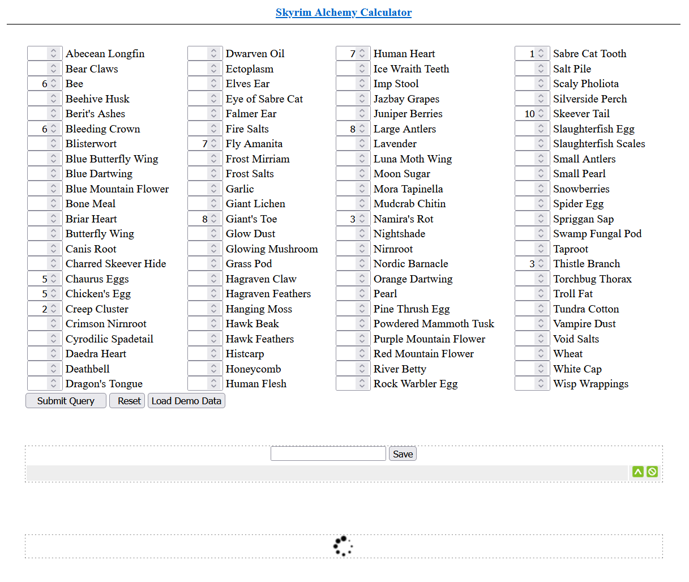

# Skyrim Alchemy Calculator

This project is used to quickly generate a list of alchemy recipes for Skyrim using the ingredients you have on hand. It will then sort them by the most profitable and, by association, quickly level your alchemy skills. You can then save your existing ingredient list and come back to it later.

This was a written as a quick weekend project in January of 2012. None of the existing calculators had a UI that was clean and easy to use. I hosted this on my blog for a while but eventually took it down after I lost interest in maintaining it. However, some folks have expressed interest in the code so I am posting it here. I promise I'm a better coder now! :D

This was written in Python 2. `alch.cgi` is intended to run as a cgi script fronted by Apache. I didn't know much about lightweight python frameworks at the time but I also wanted to keep this as basic as possible. Just simple HTML and Javascript on the frontend.

The recipes are precalculated and stored in a python pickle file. Pickles are a way to serialize a python object and save it so you can pick them back up later. The recipes were ripped from another alchemy calculator; this project never actually calculated the recipes directly. I was unable to find a succinct list of updated recipes when expansions added new ingredients so I never added recipes after vanilla Skyrim.

If I was rewriting this today, I would avoid using any backend and allow this to exist entirely in the browser. There's no requirement that a backend service should do the processing except that I was more familiar with Python at the time. I also had some intention to monetize it at some point but in the small amount of time I ran ads it never made enough with Google Adwords to even cash out the earnings. That has since been stripped from the code.

At some point, I started down the path a rewrite to use the new ingredients from Dawnguard but didn't finish this up. That can be found under [dawnguard](dawnguard). It was going to be a complete rewrite but I didn't get much further than compiling a list of ingredients and recipes. Sorting out what recipes were valuable was going to be a challenge. The state of this code is largely unknown.

---

